# R Package Documentation

## add_access_to_phone_best

**Description:** Access to phone and coverage

**Parameters:**
- df: 
- access_to_phone: 
- none: 
- smartphone: 
- feature_phone: 
- basic_phone: 
- dnk: 
- pnta: 
- sep: 

**Outputs:**
- access_to_phone_d_none
- access_to_phone_d_pnta
- access_to_phone_d_basic_phone
- access_to_phone_d_smartphone
- access_to_phone_d_dnk
- access_to_phone_d_vars
- access_to_phone_d_feature_phone
- df

**New/Modified Columns:**
- etc_access_to_phone_best

**Returns:** Not specified

**Function Diagram:**

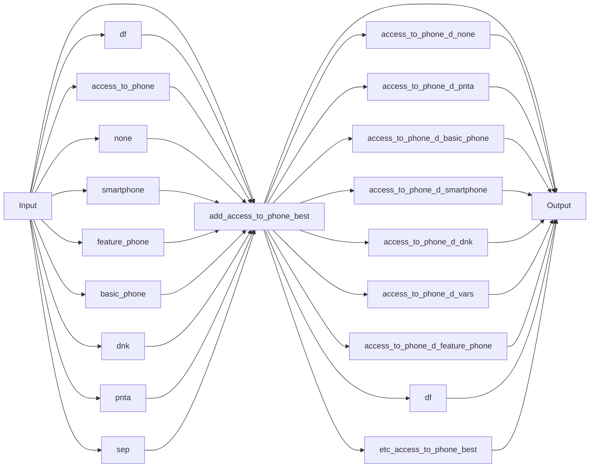
```mermaid
flowchart LR
    A[Input] --> B[add_access_to_phone_best]
    B --> C[Output]
        D0[df] --> B
    A --> D0
    D1[access_to_phone] --> B
    A --> D1
    D2[none] --> B
    A --> D2
    D3[smartphone] --> B
    A --> D3
    D4[feature_phone] --> B
    A --> D4
    D5[basic_phone] --> B
    A --> D5
    D6[dnk] --> B
    A --> D6
    D7[pnta] --> B
    A --> D7
    D8[sep] --> B
    A --> D8
    B --> E0[access_to_phone_d_none]
    E0 --> C
    B --> E1[access_to_phone_d_pnta]
    E1 --> C
    B --> E2[access_to_phone_d_basic_phone]
    E2 --> C
    B --> E3[access_to_phone_d_smartphone]
    E3 --> C
    B --> E4[access_to_phone_d_dnk]
    E4 --> C
    B --> E5[access_to_phone_d_vars]
    E5 --> C
    B --> E6[access_to_phone_d_feature_phone]
    E6 --> C
    B --> E7[df]
    E7 --> C
    B --> F0[etc_access_to_phone_best]
    F0 --> C
```

## add_access_to_phone_coverage

**Description:** 

**Parameters:**
- df: 
- coverage_network_type: 
- coverage_none: 
- coverage_no_internet: 
- coverage_yes_internet: 
- coverage_undefined: 
- access_to_phone_best: 
- access_to_phone_none: 
- access_to_basic_phone: 
- access_to_feature_phone: 
- access_to_smartphone: 
- access_to_undefined: 

**Outputs:**
- df

**New/Modified Columns:**
- etc_access_to_phone_coverage

**Returns:** Not specified

**Function Diagram:**

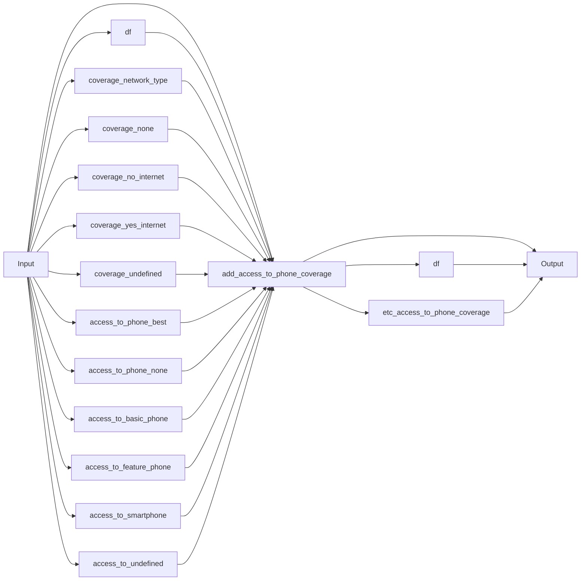
```mermaid
flowchart LR
    A[Input] --> B[add_access_to_phone_coverage]
    B --> C[Output]
        D0[df] --> B
    A --> D0
    D1[coverage_network_type] --> B
    A --> D1
    D2[coverage_none] --> B
    A --> D2
    D3[coverage_no_internet] --> B
    A --> D3
    D4[coverage_yes_internet] --> B
    A --> D4
    D5[coverage_undefined] --> B
    A --> D5
    D6[access_to_phone_best] --> B
    A --> D6
    D7[access_to_phone_none] --> B
    A --> D7
    D8[access_to_basic_phone] --> B
    A --> D8
    D9[access_to_feature_phone] --> B
    A --> D9
    D10[access_to_smartphone] --> B
    A --> D10
    D11[access_to_undefined] --> B
    A --> D11
    B --> E0[df]
    E0 --> C
    B --> F0[etc_access_to_phone_coverage]
    F0 --> C
```

## add_age_cat

**Description:** Add categories of age

**Parameters:**
- df: 
- age_col: 
- breaks: 
- labels: 
- int_undefined: 
- char_undefined: 
- new_colname: 

**Outputs:**
- df

**New/Modified Columns:**

**Returns:** Not specified

**Function Diagram:**

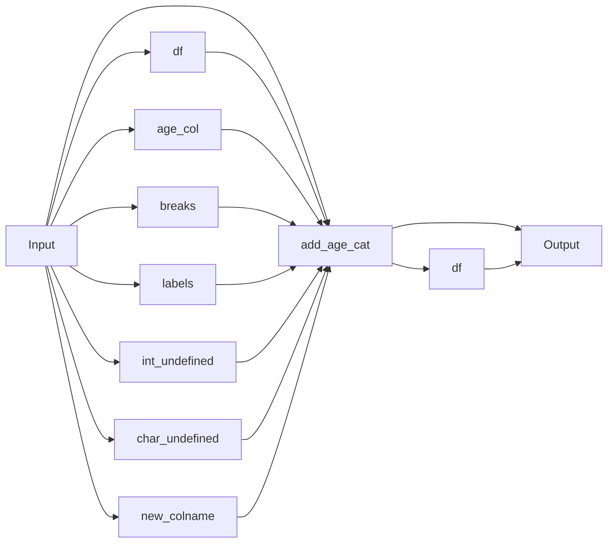
```mermaid
flowchart LR
    A[Input] --> B[add_age_cat]
    B --> C[Output]
        D0[df] --> B
    A --> D0
    D1[age_col] --> B
    A --> D1
    D2[breaks] --> B
    A --> D2
    D3[labels] --> B
    A --> D3
    D4[int_undefined] --> B
    A --> D4
    D5[char_undefined] --> B
    A --> D5
    D6[new_colname] --> B
    A --> D6
    B --> E0[df]
    E0 --> C
```

## add_age_18_cat

**Description:** 

**Parameters:**
- df: 
- age_col: 
- int_undefined: 
- char_undefined: 
- new_colname: 

**Outputs:**
- new_colname
- new_colname_d
- df

**New/Modified Columns:**

**Returns:** Not specified

**Function Diagram:**

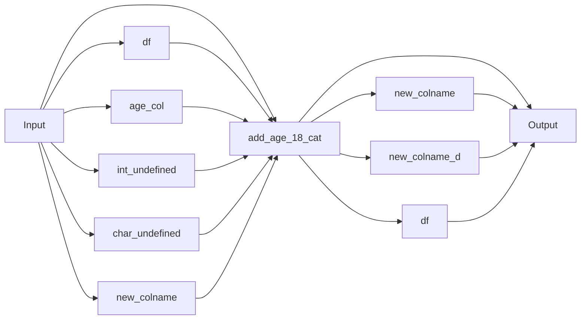
```mermaid
flowchart LR
    A[Input] --> B[add_age_18_cat]
    B --> C[Output]
        D0[df] --> B
    A --> D0
    D1[age_col] --> B
    A --> D1
    D2[int_undefined] --> B
    A --> D2
    D3[char_undefined] --> B
    A --> D3
    D4[new_colname] --> B
    A --> D4
    B --> E0[new_colname]
    E0 --> C
    B --> E1[new_colname_d]
    E1 --> C
    B --> E2[df]
    E2 --> C
```

## add_child_sep_cat

**Description:** Add child separation categories

**Parameters:**
- df: 
- child_sep: 
- child_sep_yes: 
- child_sep_no: 
- child_sep_undefined: 
- child_sep_reason: 
- child_sep_reason_non_severe: 
- child_sep_reason_severe: 
- child_sep_reason_very_severe: 
- child_sep_reason_undefined: 
- sep: 

**Outputs:**
- child_sep_reason_d_severe
- child_sep_reason_d_non_severe
- child_sep_reason_d_very_severe
- child_sep_reason_d_undefined
- df

**New/Modified Columns:**
- prot_child_sep_cat

**Returns:** Not specified

**Function Diagram:**

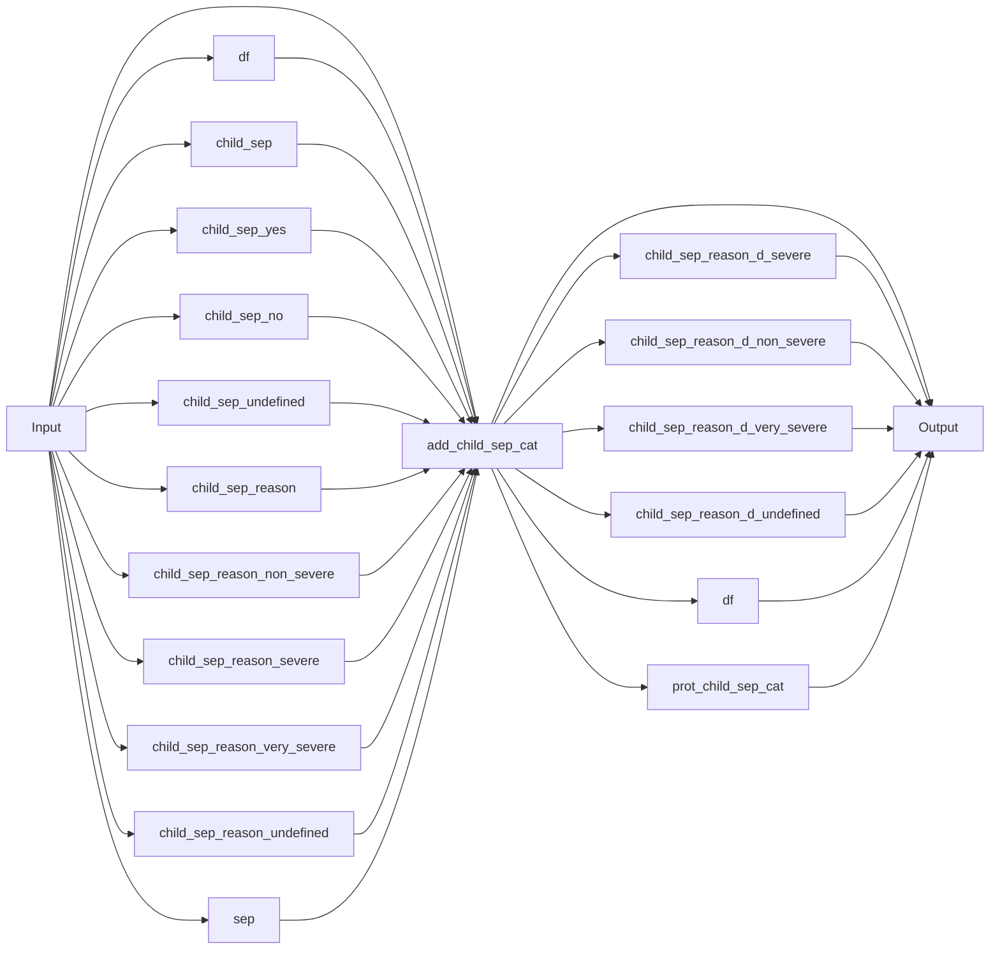
```mermaid
flowchart LR
    A[Input] --> B[add_child_sep_cat]
    B --> C[Output]
        D0[df] --> B
    A --> D0
    D1[child_sep] --> B
    A --> D1
    D2[child_sep_yes] --> B
    A --> D2
    D3[child_sep_no] --> B
    A --> D3
    D4[child_sep_undefined] --> B
    A --> D4
    D5[child_sep_reason] --> B
    A --> D5
    D6[child_sep_reason_non_severe] --> B
    A --> D6
    D7[child_sep_reason_severe] --> B
    A --> D7
    D8[child_sep_reason_very_severe] --> B
    A --> D8
    D9[child_sep_reason_undefined] --> B
    A --> D9
    D10[sep] --> B
    A --> D10
    B --> E0[child_sep_reason_d_severe]
    E0 --> C
    B --> E1[child_sep_reason_d_non_severe]
    E1 --> C
    B --> E2[child_sep_reason_d_very_severe]
    E2 --> C
    B --> E3[child_sep_reason_d_undefined]
    E3 --> C
    B --> E4[df]
    E4 --> C
    B --> F0[prot_child_sep_cat]
    F0 --> C
```

## add_comp_edu

**Description:** Education sectoral composite - add score and dummy for in need

**Parameters:**
- df: 
- schooling_age_n: 
- no_access_n: 
- barrier_protection_n: 
- occupation_n: 
- hazards_n: 
- displaced_n: 
- teacher_n: 

**Outputs:**
- df

**New/Modified Columns:**
- comp_edu_score_disrupted
- comp_edu_score_attendance
- comp_edu_score

**Returns:** Not specified

**Function Diagram:**

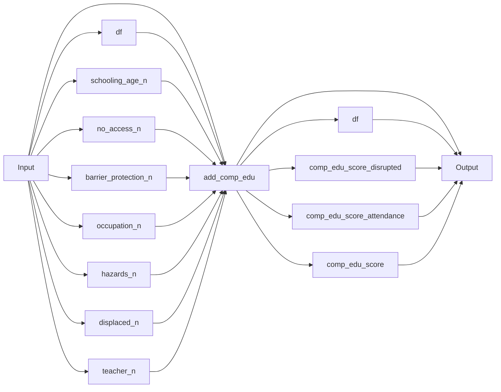
```mermaid
flowchart LR
    A[Input] --> B[add_comp_edu]
    B --> C[Output]
        D0[df] --> B
    A --> D0
    D1[schooling_age_n] --> B
    A --> D1
    D2[no_access_n] --> B
    A --> D2
    D3[barrier_protection_n] --> B
    A --> D3
    D4[occupation_n] --> B
    A --> D4
    D5[hazards_n] --> B
    A --> D5
    D6[displaced_n] --> B
    A --> D6
    D7[teacher_n] --> B
    A --> D7
    B --> E0[df]
    E0 --> C
    B --> F0[comp_edu_score_disrupted]
    F0 --> C
    B --> F1[comp_edu_score_attendance]
    F1 --> C
    B --> F2[comp_edu_score]
    F2 --> C
```

## add_comp_foodsec

**Description:** Food security sectoral composite - add score and dummy for in need

**Parameters:**
- df: 
- fc_phase: 
- fc_phase_levels: 

**Outputs:**
- df

**New/Modified Columns:**
- comp_foodsec_score

**Returns:** Not specified

**Function Diagram:**

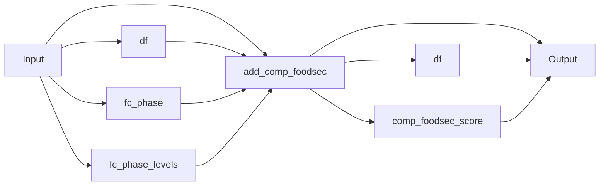
```mermaid
flowchart LR
    A[Input] --> B[add_comp_foodsec]
    B --> C[Output]
        D0[df] --> B
    A --> D0
    D1[fc_phase] --> B
    A --> D1
    D2[fc_phase_levels] --> B
    A --> D2
    B --> E0[df]
    E0 --> C
    B --> F0[comp_foodsec_score]
    F0 --> C
```

## add_comp_health

**Description:** Health composite - add score and dummy for in need

**Parameters:**
- df: 
- ind_healthcare_needed_no_n: 
- ind_healthcare_needed_yes_unmet_n: 
- ind_healthcare_needed_yes_met_n: 
- wgq_dis: 
- ind_healthcare_needed_no_wgq_dis_n: 
- ind_healthcare_needed_yes_unmet_wgq_dis_n: 
- ind_healthcare_needed_yes_met_wgq_dis_n: 

**Outputs:**
- vars_n
- vars_dis_n
- df

**New/Modified Columns:**
- comp_health_score

**Returns:** Not specified

**Function Diagram:**

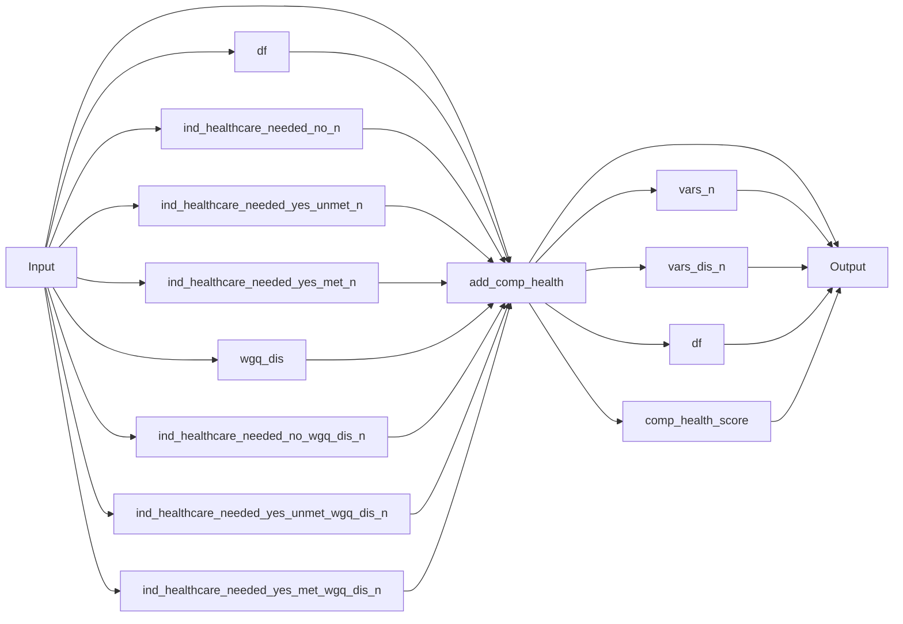
```mermaid
flowchart LR
    A[Input] --> B[add_comp_health]
    B --> C[Output]
        D0[df] --> B
    A --> D0
    D1[ind_healthcare_needed_no_n] --> B
    A --> D1
    D2[ind_healthcare_needed_yes_unmet_n] --> B
    A --> D2
    D3[ind_healthcare_needed_yes_met_n] --> B
    A --> D3
    D4[wgq_dis] --> B
    A --> D4
    D5[ind_healthcare_needed_no_wgq_dis_n] --> B
    A --> D5
    D6[ind_healthcare_needed_yes_unmet_wgq_dis_n] --> B
    A --> D6
    D7[ind_healthcare_needed_yes_met_wgq_dis_n] --> B
    A --> D7
    B --> E0[vars_n]
    E0 --> C
    B --> E1[vars_dis_n]
    E1 --> C
    B --> E2[df]
    E2 --> C
    B --> F0[comp_health_score]
    F0 --> C
```

## add_comp_prot

**Description:** Protection composite - add score and dummy for in need

**Parameters:**
- df: 
- child_sep_cat: 
- child_sep_cat_levels: 
- concern_freq_cope: 
- concern_freq_displaced: 
- concern_hh_freq_kidnapping: 
- concern_hh_freq_discrimination: 
- concern_levels: 

**Outputs:**
- df

**New/Modified Columns:**
- comp_prot_score_concern_freq_cope
- comp_prot_child_sep_cat
- default
- comp_prot_score_concern
- comp_prot_risk_always_d
- comp_prot_score

**Returns:** Not specified

**Function Diagram:**

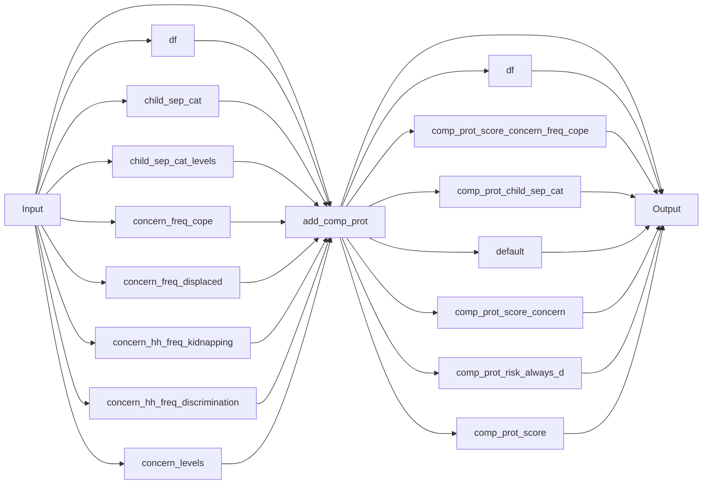
```mermaid
flowchart LR
    A[Input] --> B[add_comp_prot]
    B --> C[Output]
        D0[df] --> B
    A --> D0
    D1[child_sep_cat] --> B
    A --> D1
    D2[child_sep_cat_levels] --> B
    A --> D2
    D3[concern_freq_cope] --> B
    A --> D3
    D4[concern_freq_displaced] --> B
    A --> D4
    D5[concern_hh_freq_kidnapping] --> B
    A --> D5
    D6[concern_hh_freq_discrimination] --> B
    A --> D6
    D7[concern_levels] --> B
    A --> D7
    B --> E0[df]
    E0 --> C
    B --> F0[comp_prot_score_concern_freq_cope]
    F0 --> C
    B --> F1[comp_prot_child_sep_cat]
    F1 --> C
    B --> F2[default]
    F2 --> C
    B --> F3[comp_prot_score_concern]
    F3 --> C
    B --> F4[comp_prot_risk_always_d]
    F4 --> C
    B --> F5[comp_prot_score]
    F5 --> C
```

## add_comp_snfi

**Description:** SNFI sectoral composite - add score and dummy for in need

**Parameters:**
- df: 
- shelter_type_cat: 
- shelter_type_cat_levels: 
- shelter_issue_cat: 
- shelter_issue_cat_levels: 
- occupancy_cat: 
- occupancy_cat_levels: 
- fds_cannot_cat: 
- fds_cannot_cat_levels: 

**Outputs:**
- df

**New/Modified Columns:**
- comp_snfi_score_shelter_issue_cat
- comp_snfi_score_occupancy_cat
- comp_snfi_score
- comp_snfi_score_shelter_type_cat
- comp_snfi_score_fds_cannot_cat

**Returns:** Not specified

**Function Diagram:**

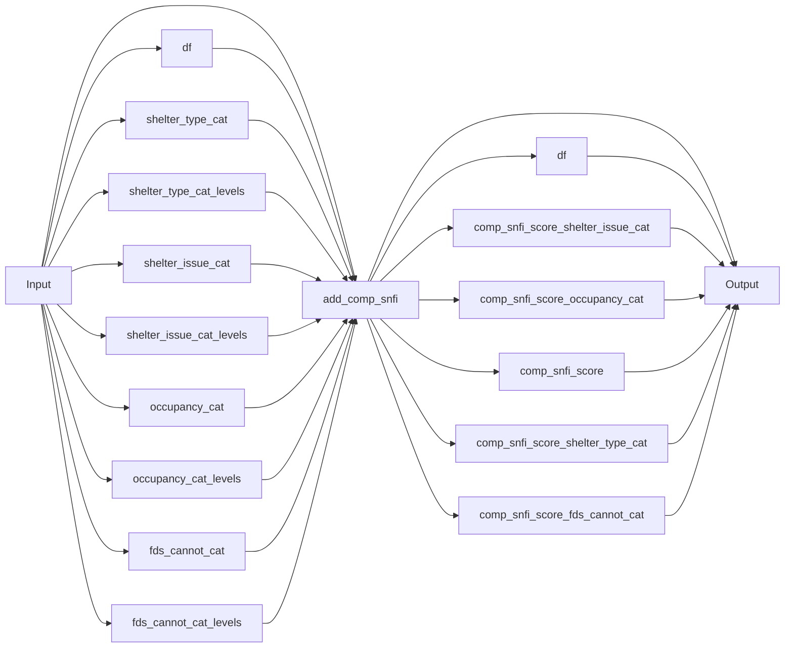
```mermaid
flowchart LR
    A[Input] --> B[add_comp_snfi]
    B --> C[Output]
        D0[df] --> B
    A --> D0
    D1[shelter_type_cat] --> B
    A --> D1
    D2[shelter_type_cat_levels] --> B
    A --> D2
    D3[shelter_issue_cat] --> B
    A --> D3
    D4[shelter_issue_cat_levels] --> B
    A --> D4
    D5[occupancy_cat] --> B
    A --> D5
    D6[occupancy_cat_levels] --> B
    A --> D6
    D7[fds_cannot_cat] --> B
    A --> D7
    D8[fds_cannot_cat_levels] --> B
    A --> D8
    B --> E0[df]
    E0 --> C
    B --> F0[comp_snfi_score_shelter_issue_cat]
    F0 --> C
    B --> F1[comp_snfi_score_occupancy_cat]
    F1 --> C
    B --> F2[comp_snfi_score]
    F2 --> C
    B --> F3[comp_snfi_score_shelter_type_cat]
    F3 --> C
    B --> F4[comp_snfi_score_fds_cannot_cat]
    F4 --> C
```

## add_comp_wash

**Description:** WASH sectoral composite - add score and dummy for in need

**Parameters:**
- df: 
- setting: 
- setting_levels: 
- drinking_water_quantity: 
- drinking_water_quantity_levels: 
- drinking_water_quality_jmp_cat: 
- drinking_water_quality_jmp_cat_levels: 
- sanitation_facility_jmp_cat: 
- sanitation_facility_jmp_cat_levels: 
- sanitation_facility_cat: 
- sanitation_facility_cat_levels: 
- sanitation_facility_n_ind: 
- sanitation_facility_n_ind_levels: 
- handwashing_facility_jmp_cat: 
- handwashing_facility_jmp_cat_levels: 

**Outputs:**
- df

**New/Modified Columns:**
- comp_wash_score_water_quantity
- comp_wash_score

**Returns:** Not specified

**Function Diagram:**

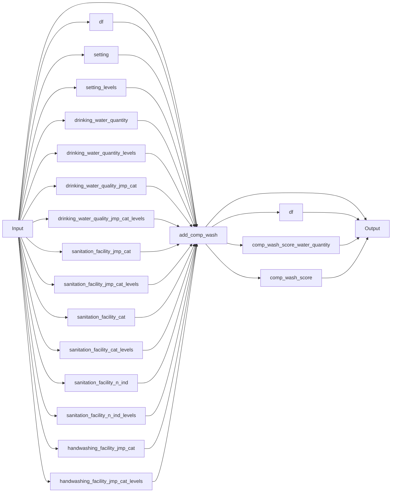
```mermaid
flowchart LR
    A[Input] --> B[add_comp_wash]
    B --> C[Output]
        D0[df] --> B
    A --> D0
    D1[setting] --> B
    A --> D1
    D2[setting_levels] --> B
    A --> D2
    D3[drinking_water_quantity] --> B
    A --> D3
    D4[drinking_water_quantity_levels] --> B
    A --> D4
    D5[drinking_water_quality_jmp_cat] --> B
    A --> D5
    D6[drinking_water_quality_jmp_cat_levels] --> B
    A --> D6
    D7[sanitation_facility_jmp_cat] --> B
    A --> D7
    D8[sanitation_facility_jmp_cat_levels] --> B
    A --> D8
    D9[sanitation_facility_cat] --> B
    A --> D9
    D10[sanitation_facility_cat_levels] --> B
    A --> D10
    D11[sanitation_facility_n_ind] --> B
    A --> D11
    D12[sanitation_facility_n_ind_levels] --> B
    A --> D12
    D13[handwashing_facility_jmp_cat] --> B
    A --> D13
    D14[handwashing_facility_jmp_cat_levels] --> B
    A --> D14
    B --> E0[df]
    E0 --> C
    B --> F0[comp_wash_score_water_quantity]
    F0 --> C
    B --> F1[comp_wash_score]
    F1 --> C
```

## add_drinking_water_source_cat

**Description:** Drinking water source recoding

**Parameters:**
- df: 
- drinking_water_source: 
- improved: 
- unimproved: 
- surface_water: 
- undefined: 

**Outputs:**
- df

**New/Modified Columns:**
- wash_drinking_water_source_cat

**Returns:** Not specified

**Function Diagram:**

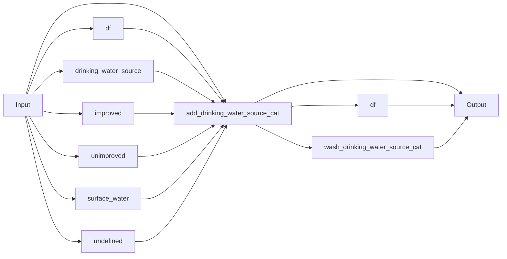
```mermaid
flowchart LR
    A[Input] --> B[add_drinking_water_source_cat]
    B --> C[Output]
        D0[df] --> B
    A --> D0
    D1[drinking_water_source] --> B
    A --> D1
    D2[improved] --> B
    A --> D2
    D3[unimproved] --> B
    A --> D3
    D4[surface_water] --> B
    A --> D4
    D5[undefined] --> B
    A --> D5
    B --> E0[df]
    E0 --> C
    B --> F0[wash_drinking_water_source_cat]
    F0 --> C
```

## add_drinking_water_time_cat

**Description:** 

**Parameters:**
- df: 
- drinking_water_time_yn: 
- water_on_premises: 
- number_minutes: 
- dnk: 
- undefined: 
- drinking_water_time_int: 
- max: 
- drinking_water_time_sl: 
- sl_under_30_min: 
- sl_30min_1hr: 
- sl_more_than_1hr: 
- sl_undefined: 
- drinking_water_source: 
- skipped_drinking_water_source_premises: 
- skipped_drinking_water_source_undefined: 

**Outputs:**
- df

**New/Modified Columns:**
- wash_drinking_water_time_cat

**Returns:** Not specified

**Function Diagram:**

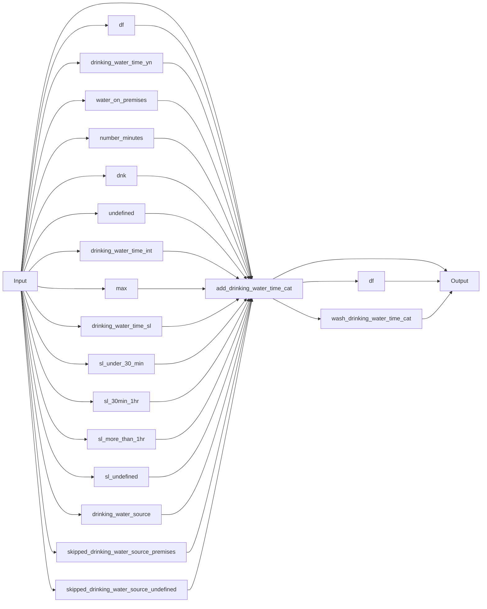
```mermaid
flowchart LR
    A[Input] --> B[add_drinking_water_time_cat]
    B --> C[Output]
        D0[df] --> B
    A --> D0
    D1[drinking_water_time_yn] --> B
    A --> D1
    D2[water_on_premises] --> B
    A --> D2
    D3[number_minutes] --> B
    A --> D3
    D4[dnk] --> B
    A --> D4
    D5[undefined] --> B
    A --> D5
    D6[drinking_water_time_int] --> B
    A --> D6
    D7[max] --> B
    A --> D7
    D8[drinking_water_time_sl] --> B
    A --> D8
    D9[sl_under_30_min] --> B
    A --> D9
    D10[sl_30min_1hr] --> B
    A --> D10
    D11[sl_more_than_1hr] --> B
    A --> D11
    D12[sl_undefined] --> B
    A --> D12
    D13[drinking_water_source] --> B
    A --> D13
    D14[skipped_drinking_water_source_premises] --> B
    A --> D14
    D15[skipped_drinking_water_source_undefined] --> B
    A --> D15
    B --> E0[df]
    E0 --> C
    B --> F0[wash_drinking_water_time_cat]
    F0 --> C
```

## add_drinking_water_time_threshold_cat

**Description:** 

**Parameters:**
- df: 
- drinking_water_time_cat: 
- premises: 
- under_30min: 
- above_30min: 
- undefined: 

**Outputs:**
- df

**New/Modified Columns:**
- wash_drinking_water_time_30min_cat

**Returns:** Not specified

**Function Diagram:**

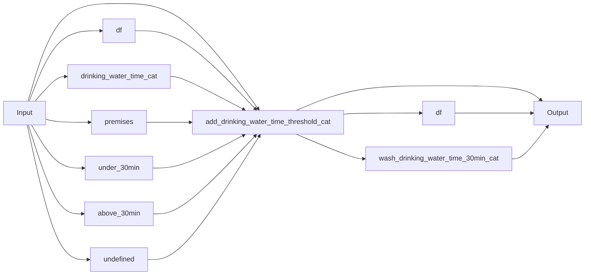
```mermaid
flowchart LR
    A[Input] --> B[add_drinking_water_time_threshold_cat]
    B --> C[Output]
        D0[df] --> B
    A --> D0
    D1[drinking_water_time_cat] --> B
    A --> D1
    D2[premises] --> B
    A --> D2
    D3[under_30min] --> B
    A --> D3
    D4[above_30min] --> B
    A --> D4
    D5[undefined] --> B
    A --> D5
    B --> E0[df]
    E0 --> C
    B --> F0[wash_drinking_water_time_30min_cat]
    F0 --> C
```

## add_expenditure_type_prop_freq

**Description:** Add frequent expenditure type amount as proportions of total frequent expenditure

**Parameters:**
- df: 
- cm_expenditure_frequent_food: 
- cm_expenditure_frequent_rent: 
- cm_expenditure_frequent_water: 
- cm_expenditure_frequent_nfi: 
- cm_expenditure_frequent_utilitiues: 
- cm_expenditure_frequent_fuel: 
- cm_expenditure_frequent_transportation: 
- cm_expenditure_frequent_communication: 
- cm_expenditure_frequent_other: 

**Outputs:**
- expenditure_freq_types
- df

**New/Modified Columns:**

**Returns:** Not specified

**Function Diagram:**

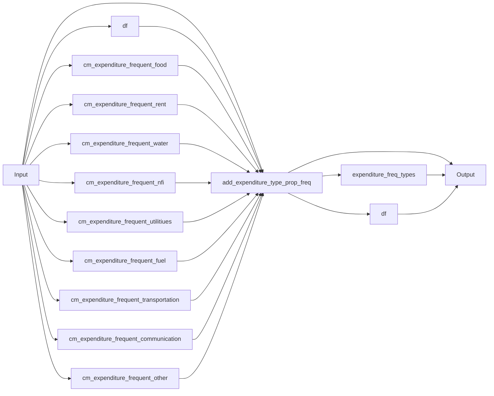
```mermaid
flowchart LR
    A[Input] --> B[add_expenditure_type_prop_freq]
    B --> C[Output]
        D0[df] --> B
    A --> D0
    D1[cm_expenditure_frequent_food] --> B
    A --> D1
    D2[cm_expenditure_frequent_rent] --> B
    A --> D2
    D3[cm_expenditure_frequent_water] --> B
    A --> D3
    D4[cm_expenditure_frequent_nfi] --> B
    A --> D4
    D5[cm_expenditure_frequent_utilitiues] --> B
    A --> D5
    D6[cm_expenditure_frequent_fuel] --> B
    A --> D6
    D7[cm_expenditure_frequent_transportation] --> B
    A --> D7
    D8[cm_expenditure_frequent_communication] --> B
    A --> D8
    D9[cm_expenditure_frequent_other] --> B
    A --> D9
    B --> E0[expenditure_freq_types]
    E0 --> C
    B --> E1[df]
    E1 --> C
```

## add_expenditure_type_prop_infreq

**Description:** Add infrequent expenditure type amount as proportions of total infrequent expenditure

**Parameters:**
- df: 
- cm_expenditure_infrequent_shelter: 
- cm_expenditure_infrequent_nfi: 
- cm_expenditure_infrequent_health: 
- cm_expenditure_infrequent_education: 
- cm_expenditure_infrequent_debt: 
- cm_expenditure_infrequent_other: 

**Outputs:**
- expenditure_infreq_types
- df

**New/Modified Columns:**

**Returns:** Not specified

**Function Diagram:**

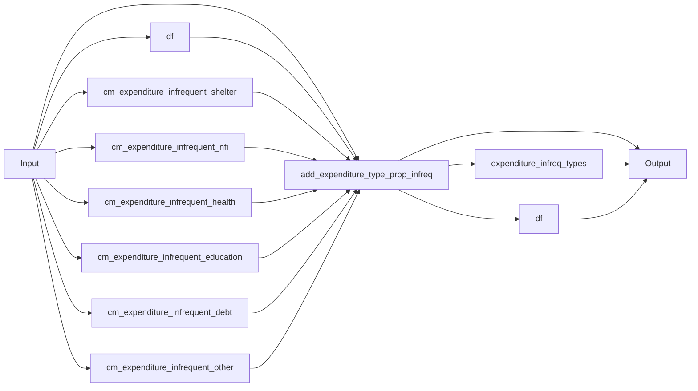
```mermaid
flowchart LR
    A[Input] --> B[add_expenditure_type_prop_infreq]
    B --> C[Output]
        D0[df] --> B
    A --> D0
    D1[cm_expenditure_infrequent_shelter] --> B
    A --> D1
    D2[cm_expenditure_infrequent_nfi] --> B
    A --> D2
    D3[cm_expenditure_infrequent_health] --> B
    A --> D3
    D4[cm_expenditure_infrequent_education] --> B
    A --> D4
    D5[cm_expenditure_infrequent_debt] --> B
    A --> D5
    D6[cm_expenditure_infrequent_other] --> B
    A --> D6
    B --> E0[expenditure_infreq_types]
    E0 --> C
    B --> E1[df]
    E1 --> C
```

## add_expenditure_type_zero_freq

**Description:** Add zero when the frequent expenditure type was skipped

**Parameters:**
- df: 
- expenditure_freq: 
- undefined: 
- expenditure_freq_types: 

**Outputs:**
- df

**New/Modified Columns:**

**Returns:** Not specified

**Function Diagram:**

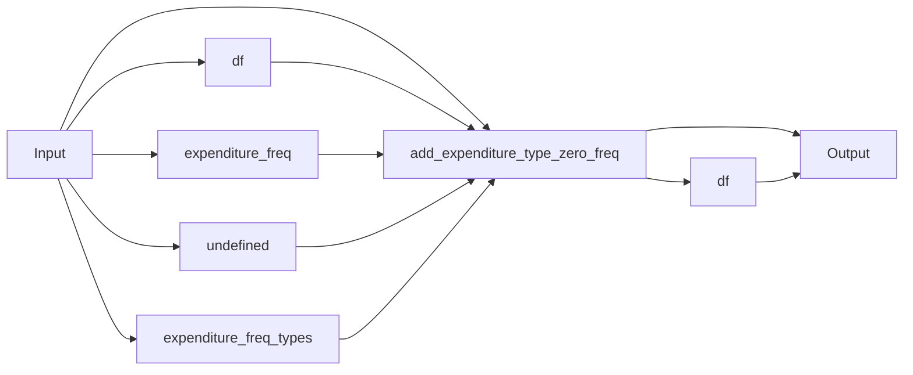
```mermaid
flowchart LR
    A[Input] --> B[add_expenditure_type_zero_freq]
    B --> C[Output]
        D0[df] --> B
    A --> D0
    D1[expenditure_freq] --> B
    A --> D1
    D2[undefined] --> B
    A --> D2
    D3[expenditure_freq_types] --> B
    A --> D3
    B --> E0[df]
    E0 --> C
```

## add_expenditure_type_zero_infreq

**Description:** Add zero when the infrequent expenditure type was skipped

**Parameters:**
- df: 
- expenditure_infreq: 
- undefined: 
- expenditure_infreq_types: 

**Outputs:**
- df

**New/Modified Columns:**

**Returns:** Not specified

**Function Diagram:**

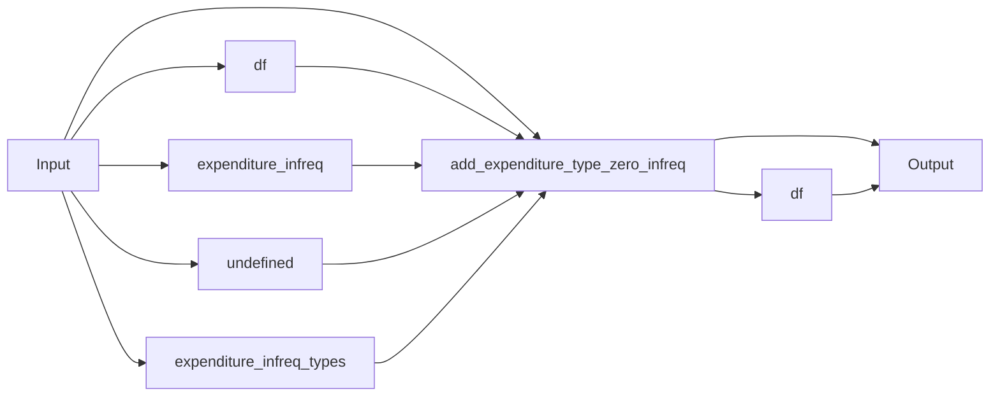
```mermaid
flowchart LR
    A[Input] --> B[add_expenditure_type_zero_infreq]
    B --> C[Output]
        D0[df] --> B
    A --> D0
    D1[expenditure_infreq] --> B
    A --> D1
    D2[undefined] --> B
    A --> D2
    D3[expenditure_infreq_types] --> B
    A --> D3
    B --> E0[df]
    E0 --> C
```

## add_fds_cannot_cat

**Description:** Add functional domestic space tasks categories

**Parameters:**
- df: 
- fds_cooking: 
- fds_cooking_cannot: 
- fds_cooking_can_issues: 
- fds_cooking_can_no_issues: 
- fds_cooking_no_need: 
- fds_cooking_undefined: 
- fds_sleeping: 
- fds_sleeping_cannot: 
- fds_sleeping_can_issues: 
- fds_sleeping_can_no_issues: 
- fds_sleeping_undefined: 
- fds_storing: 
- fds_storing_cannot: 
- fds_storing_can_issues: 
- fds_storing_can_no_issues: 
- fds_storing_undefined: 
- fds_personal_hygiene: 
- fds_personal_hygiene_cannot: 
- fds_personal_hygiene_can_issues: 
- fds_personal_hygiene_can_no_issues: 
- fds_personal_hygiene_undefined: 
- lighting_source: 
- lighting_source_none: 
- lighting_source_undefined: 

**Outputs:**
- df

**New/Modified Columns:**
- snfi_fds_cannot_n
- x
- snfi_fds_cooking
- default
- energy_lighting_source
- snfi_fds_cannot_cat
- energy_lighting_source_d

**Returns:** Not specified

**Function Diagram:**

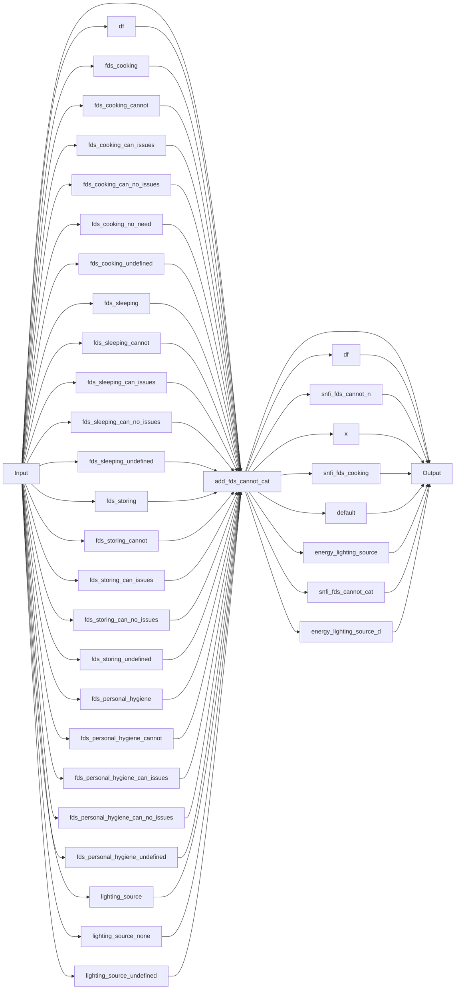
```mermaid
flowchart LR
    A[Input] --> B[add_fds_cannot_cat]
    B --> C[Output]
        D0[df] --> B
    A --> D0
    D1[fds_cooking] --> B
    A --> D1
    D2[fds_cooking_cannot] --> B
    A --> D2
    D3[fds_cooking_can_issues] --> B
    A --> D3
    D4[fds_cooking_can_no_issues] --> B
    A --> D4
    D5[fds_cooking_no_need] --> B
    A --> D5
    D6[fds_cooking_undefined] --> B
    A --> D6
    D7[fds_sleeping] --> B
    A --> D7
    D8[fds_sleeping_cannot] --> B
    A --> D8
    D9[fds_sleeping_can_issues] --> B
    A --> D9
    D10[fds_sleeping_can_no_issues] --> B
    A --> D10
    D11[fds_sleeping_undefined] --> B
    A --> D11
    D12[fds_storing] --> B
    A --> D12
    D13[fds_storing_cannot] --> B
    A --> D13
    D14[fds_storing_can_issues] --> B
    A --> D14
    D15[fds_storing_can_no_issues] --> B
    A --> D15
    D16[fds_storing_undefined] --> B
    A --> D16
    D17[fds_personal_hygiene] --> B
    A --> D17
    D18[fds_personal_hygiene_cannot] --> B
    A --> D18
    D19[fds_personal_hygiene_can_issues] --> B
    A --> D19
    D20[fds_personal_hygiene_can_no_issues] --> B
    A --> D20
    D21[fds_personal_hygiene_undefined] --> B
    A --> D21
    D22[lighting_source] --> B
    A --> D22
    D23[lighting_source_none] --> B
    A --> D23
    D24[lighting_source_undefined] --> B
    A --> D24
    B --> E0[df]
    E0 --> C
    B --> F0[snfi_fds_cannot_n]
    F0 --> C
    B --> F1[x]
    F1 --> C
    B --> F2[snfi_fds_cooking]
    F2 --> C
    B --> F3[default]
    F3 --> C
    B --> F4[energy_lighting_source]
    F4 --> C
    B --> F5[snfi_fds_cannot_cat]
    F5 --> C
    B --> F6[energy_lighting_source_d]
    F6 --> C
```

## add_handwashing_facility_cat

**Description:** Add frequent expenditure type amount as proportions of total frequent expenditure

**Parameters:**
- df: 
- survey_modality: 
- survey_modality_in_person: 
- survey_modality_remote: 
- facility: 
- facility_yes: 
- facility_no: 
- facility_no_permission: 
- facility_undefined: 
- facility_observed_water: 
- facility_observed_water_yes: 
- facility_observed_water_no: 
- facility_observed_soap: 
- facility_observed_soap_yes: 
- facility_observed_soap_no: 
- facility_observed_soap_alternative: 
- facility_reported: 
- facility_reported_yes: 
- facility_reported_no: 
- facility_reported_undefined: 
- facility_reported_no_permission_soap: 
- facility_reported_no_permission_soap_yes: 
- facility_reported_no_permission_soap_no: 
- facility_reported_no_permission_soap_undefined: 
- facility_reported_no_permission_soap_type: 
- facility_reported_no_permission_soap_type_yes: 
- facility_reported_no_permission_soap_type_no: 
- facility_reported_no_permission_soap_type_undefined: 
- facility_reported_remote_soap: 
- facility_reported_remote_soap_yes: 
- facility_reported_remote_soap_no: 
- facility_reported_remote_soap_undefined: 
- facility_reported_remote_soap_type: 
- facility_reported_remote_soap_type_yes: 
- facility_reported_remote_soap_type_no: 
- facility_reported_remote_soap_type_undefined: 

**Outputs:**
- df

**New/Modified Columns:**
- wash_handwashing_facility_jmp_cat

**Returns:** Not specified

**Function Diagram:**

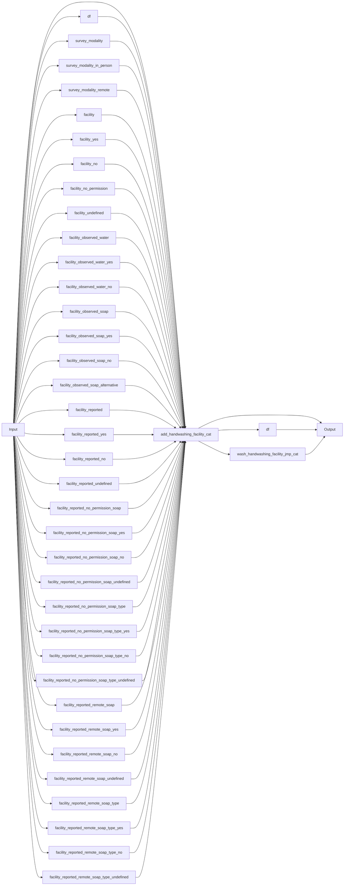
```mermaid
flowchart LR
    A[Input] --> B[add_handwashing_facility_cat]
    B --> C[Output]
        D0[df] --> B
    A --> D0
    D1[survey_modality] --> B
    A --> D1
    D2[survey_modality_in_person] --> B
    A --> D2
    D3[survey_modality_remote] --> B
    A --> D3
    D4[facility] --> B
    A --> D4
    D5[facility_yes] --> B
    A --> D5
    D6[facility_no] --> B
    A --> D6
    D7[facility_no_permission] --> B
    A --> D7
    D8[facility_undefined] --> B
    A --> D8
    D9[facility_observed_water] --> B
    A --> D9
    D10[facility_observed_water_yes] --> B
    A --> D10
    D11[facility_observed_water_no] --> B
    A --> D11
    D12[facility_observed_soap] --> B
    A --> D12
    D13[facility_observed_soap_yes] --> B
    A --> D13
    D14[facility_observed_soap_no] --> B
    A --> D14
    D15[facility_observed_soap_alternative] --> B
    A --> D15
    D16[facility_reported] --> B
    A --> D16
    D17[facility_reported_yes] --> B
    A --> D17
    D18[facility_reported_no] --> B
    A --> D18
    D19[facility_reported_undefined] --> B
    A --> D19
    D20[facility_reported_no_permission_soap] --> B
    A --> D20
    D21[facility_reported_no_permission_soap_yes] --> B
    A --> D21
    D22[facility_reported_no_permission_soap_no] --> B
    A --> D22
    D23[facility_reported_no_permission_soap_undefined] --> B
    A --> D23
    D24[facility_reported_no_permission_soap_type] --> B
    A --> D24
    D25[facility_reported_no_permission_soap_type_yes] --> B
    A --> D25
    D26[facility_reported_no_permission_soap_type_no] --> B
    A --> D26
    D27[facility_reported_no_permission_soap_type_undefined] --> B
    A --> D27
    D28[facility_reported_remote_soap] --> B
    A --> D28
    D29[facility_reported_remote_soap_yes] --> B
    A --> D29
    D30[facility_reported_remote_soap_no] --> B
    A --> D30
    D31[facility_reported_remote_soap_undefined] --> B
    A --> D31
    D32[facility_reported_remote_soap_type] --> B
    A --> D32
    D33[facility_reported_remote_soap_type_yes] --> B
    A --> D33
    D34[facility_reported_remote_soap_type_no] --> B
    A --> D34
    D35[facility_reported_remote_soap_type_undefined] --> B
    A --> D35
    B --> E0[df]
    E0 --> C
    B --> F0[wash_handwashing_facility_jmp_cat]
    F0 --> C
```

## add_hoh_final

**Description:** Head of household final values (from respondent skip logic)

**Parameters:**
- df: 
- resp_hoh_yn: 
- yes: 
- no: 
- hoh_gender: 
- hoh_age: 
- resp_gender: 
- resp_age: 

**Outputs:**
- df

**New/Modified Columns:**
- hoh_gender

**Returns:** Not specified

**Function Diagram:**

```mermaid
flowchart LR
    A[Input] --> B[add_hoh_final]
    B --> C[Output]
        D0[df] --> B
    A --> D0
    D1[resp_hoh_yn] --> B
    A --> D1
    D2[yes] --> B
    A --> D2
    D3[no] --> B
    A --> D3
    D4[hoh_gender] --> B
    A --> D4
    D5[hoh_age] --> B
    A --> D5
    D6[resp_gender] --> B
    A --> D6
    D7[resp_age] --> B
    A --> D7
    B --> E0[df]
    E0 --> C
    B --> F0[hoh_gender]
    F0 --> C
```

## add_income_source_rank

**Description:** Add income source categories, count, and top 3

**Parameters:**
- df: 
- emergency: 
- unstable: 
- stable: 
- other: 
- id_col: 

**Outputs:**
- income_source_cat_rec
- df

**New/Modified Columns:**

**Returns:** Not specified

**Function Diagram:**

```mermaid
flowchart LR
    A[Input] --> B[add_income_source_rank]
    B --> C[Output]
        D0[df] --> B
    A --> D0
    D1[emergency] --> B
    A --> D1
    D2[unstable] --> B
    A --> D2
    D3[stable] --> B
    A --> D3
    D4[other] --> B
    A --> D4
    D5[id_col] --> B
    A --> D5
    B --> E0[income_source_cat_rec]
    E0 --> C
    B --> E1[df]
    E1 --> C
```

## add_income_source_prop

**Description:** Add income source amount as proportions of total income

**Parameters:**
- df: 
- income_souce_salaried_n: 
- income_source_casual_n: 
- income_source_own_business_n: 
- income_source_own_production_n: 
- income_source_social_benefits_n: 
- income_source_rent_n: 
- income_source_remittances_n: 
- income_source_assistance_n: 
- income_source_support_friends_n: 
- income_source_donation_n: 
- income_source_other_n: 

**Outputs:**
- df
- income_sources

**New/Modified Columns:**

**Returns:** Not specified

**Function Diagram:**

```mermaid
flowchart LR
    A[Input] --> B[add_income_source_prop]
    B --> C[Output]
        D0[df] --> B
    A --> D0
    D1[income_souce_salaried_n] --> B
    A --> D1
    D2[income_source_casual_n] --> B
    A --> D2
    D3[income_source_own_business_n] --> B
    A --> D3
    D4[income_source_own_production_n] --> B
    A --> D4
    D5[income_source_social_benefits_n] --> B
    A --> D5
    D6[income_source_rent_n] --> B
    A --> D6
    D7[income_source_remittances_n] --> B
    A --> D7
    D8[income_source_assistance_n] --> B
    A --> D8
    D9[income_source_support_friends_n] --> B
    A --> D9
    D10[income_source_donation_n] --> B
    A --> D10
    D11[income_source_other_n] --> B
    A --> D11
    B --> E0[df]
    E0 --> C
    B --> E1[income_sources]
    E1 --> C
```

## add_income_source_zero_to_sl

**Description:** Add zero when the income source was skipped

**Parameters:**
- df: 
- income_source: 
- undefined: 
- income_sources: 

**Outputs:**
- df

**New/Modified Columns:**

**Returns:** Not specified

**Function Diagram:**

```mermaid
flowchart LR
    A[Input] --> B[add_income_source_zero_to_sl]
    B --> C[Output]
        D0[df] --> B
    A --> D0
    D1[income_source] --> B
    A --> D1
    D2[undefined] --> B
    A --> D2
    D3[income_sources] --> B
    A --> D3
    B --> E0[df]
    E0 --> C
```

## add_loop_age_dummy

**Description:** Add a dummy variable for an age class

**Parameters:**
- loop: 
- ind_age: 
- lb: 
- ub: 
- new_colname: 

**Outputs:**
- new_colname
- loop

**New/Modified Columns:**

**Returns:** Not specified

**Function Diagram:**

```mermaid
flowchart LR
    A[Input] --> B[add_loop_age_dummy]
    B --> C[Output]
        D0[loop] --> B
    A --> D0
    D1[ind_age] --> B
    A --> D1
    D2[lb] --> B
    A --> D2
    D3[ub] --> B
    A --> D3
    D4[new_colname] --> B
    A --> D4
    B --> E0[new_colname]
    E0 --> C
    B --> E1[loop]
    E1 --> C
```

## add_loop_age_dummy_to_main

**Description:** 

**Parameters:**
- main: 
- loop: 
- ind_age_dummy: 
- id_col_main: 
- id_col_loop: 
- new_colname: 

**Outputs:**
- new_colname
- loop
- main

**New/Modified Columns:**

**Returns:** Not specified

**Function Diagram:**

```mermaid
flowchart LR
    A[Input] --> B[add_loop_age_dummy_to_main]
    B --> C[Output]
        D0[main] --> B
    A --> D0
    D1[loop] --> B
    A --> D1
    D2[ind_age_dummy] --> B
    A --> D2
    D3[id_col_main] --> B
    A --> D3
    D4[id_col_loop] --> B
    A --> D4
    D5[new_colname] --> B
    A --> D5
    B --> E0[new_colname]
    E0 --> C
    B --> E1[loop]
    E1 --> C
    B --> E2[main]
    E2 --> C
```

## add_loop_age_gender_dummy

**Description:** 

**Parameters:**
- loop: 
- ind_age: 
- lb: 
- ub: 
- ind_gender: 
- gender: 
- new_colname: 

**Outputs:**
- new_colname
- loop

**New/Modified Columns:**

**Returns:** Not specified

**Function Diagram:**

```mermaid
flowchart LR
    A[Input] --> B[add_loop_age_gender_dummy]
    B --> C[Output]
        D0[loop] --> B
    A --> D0
    D1[ind_age] --> B
    A --> D1
    D2[lb] --> B
    A --> D2
    D3[ub] --> B
    A --> D3
    D4[ind_gender] --> B
    A --> D4
    D5[gender] --> B
    A --> D5
    D6[new_colname] --> B
    A --> D6
    B --> E0[new_colname]
    E0 --> C
    B --> E1[loop]
    E1 --> C
```

## add_loop_age_gender_dummy_to_main

**Description:** 

**Parameters:**
- main: 
- loop: 
- ind_age_gender_dummy: 
- id_col_main: 
- id_col_loop: 
- new_colname: 

**Outputs:**
- new_colname
- loop
- main

**New/Modified Columns:**

**Returns:** Not specified

**Function Diagram:**

```mermaid
flowchart LR
    A[Input] --> B[add_loop_age_gender_dummy_to_main]
    B --> C[Output]
        D0[main] --> B
    A --> D0
    D1[loop] --> B
    A --> D1
    D2[ind_age_gender_dummy] --> B
    A --> D2
    D3[id_col_main] --> B
    A --> D3
    D4[id_col_loop] --> B
    A --> D4
    D5[new_colname] --> B
    A --> D5
    B --> E0[new_colname]
    E0 --> C
    B --> E1[loop]
    E1 --> C
    B --> E2[main]
    E2 --> C
```

## add_loop_edu_access_d

**Description:** Add education access dummy

**Parameters:**
- loop: 
- ind_access: 
- yes: 
- no: 
- pnta: 
- dnk: 
- ind_schooling_age_d: 

**Outputs:**
- loop

**New/Modified Columns:**
- edu_ind_access_d

**Returns:** Not specified

**Function Diagram:**

```mermaid
flowchart LR
    A[Input] --> B[add_loop_edu_access_d]
    B --> C[Output]
        D0[loop] --> B
    A --> D0
    D1[ind_access] --> B
    A --> D1
    D2[yes] --> B
    A --> D2
    D3[no] --> B
    A --> D3
    D4[pnta] --> B
    A --> D4
    D5[dnk] --> B
    A --> D5
    D6[ind_schooling_age_d] --> B
    A --> D6
    B --> E0[loop]
    E0 --> C
    B --> F0[edu_ind_access_d]
    F0 --> C
```

## add_loop_edu_access_d_to_main

**Description:** 

**Parameters:**
- main: 
- loop: 
- ind_access_d: 
- ind_no_access_d: 
- id_col_main: 
- id_col_loop: 

**Outputs:**
- main
- loop
- ind_access_d_n
- ind_no_access_d_n

**New/Modified Columns:**

**Returns:** Not specified

**Function Diagram:**

```mermaid
flowchart LR
    A[Input] --> B[add_loop_edu_access_d_to_main]
    B --> C[Output]
        D0[main] --> B
    A --> D0
    D1[loop] --> B
    A --> D1
    D2[ind_access_d] --> B
    A --> D2
    D3[ind_no_access_d] --> B
    A --> D3
    D4[id_col_main] --> B
    A --> D4
    D5[id_col_loop] --> B
    A --> D5
    B --> E0[main]
    E0 --> C
    B --> E1[loop]
    E1 --> C
    B --> E2[ind_access_d_n]
    E2 --> C
    B --> E3[ind_no_access_d_n]
    E3 --> C
```

## add_loop_edu_barrier_protection_d

**Description:** Add a variable for child protection barriers to education

**Parameters:**
- loop: 
- barriers: 
- protection_issues: 
- ind_schooling_age_d: 

**Outputs:**
- loop

**New/Modified Columns:**

**Returns:** Not specified

**Function Diagram:**

```mermaid
flowchart LR
    A[Input] --> B[add_loop_edu_barrier_protection_d]
    B --> C[Output]
        D0[loop] --> B
    A --> D0
    D1[barriers] --> B
    A --> D1
    D2[protection_issues] --> B
    A --> D2
    D3[ind_schooling_age_d] --> B
    A --> D3
    B --> E0[loop]
    E0 --> C
```

## add_loop_edu_barrier_protection_d_to_main

**Description:** 

**Parameters:**
- main: 
- loop: 
- ind_barrier_protection_d: 
- id_col_main: 
- id_col_loop: 

**Outputs:**
- loop
- main
- ind_barrier_protection_d_n

**New/Modified Columns:**

**Returns:** Not specified

**Function Diagram:**

```mermaid
flowchart LR
    A[Input] --> B[add_loop_edu_barrier_protection_d_to_main]
    B --> C[Output]
        D0[main] --> B
    A --> D0
    D1[loop] --> B
    A --> D1
    D2[ind_barrier_protection_d] --> B
    A --> D2
    D3[id_col_main] --> B
    A --> D3
    D4[id_col_loop] --> B
    A --> D4
    B --> E0[loop]
    E0 --> C
    B --> E1[main]
    E1 --> C
    B --> E2[ind_barrier_protection_d_n]
    E2 --> C
```

## add_loop_edu_disrupted_d

**Description:** Add education disruption categories

**Parameters:**
- df: 
- occupation: 
- hazards: 
- displaced: 
- teacher: 
- levels: 
- ind_schooling_age_d: 

**Outputs:**
- hazards_d
- teacher_d
- displaced_d
- occupation_d
- df

**New/Modified Columns:**

**Returns:** Not specified

**Function Diagram:**

```mermaid
flowchart LR
    A[Input] --> B[add_loop_edu_disrupted_d]
    B --> C[Output]
        D0[df] --> B
    A --> D0
    D1[occupation] --> B
    A --> D1
    D2[hazards] --> B
    A --> D2
    D3[displaced] --> B
    A --> D3
    D4[teacher] --> B
    A --> D4
    D5[levels] --> B
    A --> D5
    D6[ind_schooling_age_d] --> B
    A --> D6
    B --> E0[hazards_d]
    E0 --> C
    B --> E1[teacher_d]
    E1 --> C
    B --> E2[displaced_d]
    E2 --> C
    B --> E3[occupation_d]
    E3 --> C
    B --> E4[df]
    E4 --> C
```

## add_loop_edu_disrupted_d_to_main

**Description:** 

**Parameters:**
- main: 
- loop: 
- occupation_d: 
- hazards_d: 
- displaced_d: 
- teacher_d: 
- id_col_main: 
- id_col_loop: 

**Outputs:**
- loop
- main

**New/Modified Columns:**

**Returns:** Not specified

**Function Diagram:**

```mermaid
flowchart LR
    A[Input] --> B[add_loop_edu_disrupted_d_to_main]
    B --> C[Output]
        D0[main] --> B
    A --> D0
    D1[loop] --> B
    A --> D1
    D2[occupation_d] --> B
    A --> D2
    D3[hazards_d] --> B
    A --> D3
    D4[displaced_d] --> B
    A --> D4
    D5[teacher_d] --> B
    A --> D5
    D6[id_col_main] --> B
    A --> D6
    D7[id_col_loop] --> B
    A --> D7
    B --> E0[loop]
    E0 --> C
    B --> E1[main]
    E1 --> C
```

## add_loop_edu_ind_age_corrected

**Description:** Add a correct schooling age to the loop

**Parameters:**
- loop: 
- main: 
- id_col_loop: 
- id_col_main: 
- survey_start_date: 
- school_year_start_month: 
- ind_age: 
- month: 

**Outputs:**
- loop
- main
- school_year_start_month_adj

**New/Modified Columns:**
- edu_ind_age_corrected
- month
- edu_ind_schooling_age_d

**Returns:** Not specified

**Function Diagram:**

```mermaid
flowchart LR
    A[Input] --> B[add_loop_edu_ind_age_corrected]
    B --> C[Output]
        D0[loop] --> B
    A --> D0
    D1[main] --> B
    A --> D1
    D2[id_col_loop] --> B
    A --> D2
    D3[id_col_main] --> B
    A --> D3
    D4[survey_start_date] --> B
    A --> D4
    D5[school_year_start_month] --> B
    A --> D5
    D6[ind_age] --> B
    A --> D6
    D7[month] --> B
    A --> D7
    B --> E0[loop]
    E0 --> C
    B --> E1[main]
    E1 --> C
    B --> E2[school_year_start_month_adj]
    E2 --> C
    B --> F0[edu_ind_age_corrected]
    F0 --> C
    B --> F1[month]
    F1 --> C
    B --> F2[edu_ind_schooling_age_d]
    F2 --> C
```

## add_loop_edu_ind_schooling_age_d_to_main

**Description:** 

**Parameters:**
- main: 
- loop: 
- ind_schooling_age_d: 
- id_col_main: 
- id_col_loop: 

**Outputs:**
- ind_schooling_age_d_n
- loop
- main

**New/Modified Columns:**

**Returns:** Not specified

**Function Diagram:**

```mermaid
flowchart LR
    A[Input] --> B[add_loop_edu_ind_schooling_age_d_to_main]
    B --> C[Output]
        D0[main] --> B
    A --> D0
    D1[loop] --> B
    A --> D1
    D2[ind_schooling_age_d] --> B
    A --> D2
    D3[id_col_main] --> B
    A --> D3
    D4[id_col_loop] --> B
    A --> D4
    B --> E0[ind_schooling_age_d_n]
    E0 --> C
    B --> E1[loop]
    E1 --> C
    B --> E2[main]
    E2 --> C
```

## add_loop_healthcare_needed_cat

**Description:** Add healthcare needed category to loop data (incl. WGQ-SS if provided)

**Parameters:**
- loop: 
- ind_healthcare_needed: 
- ind_healthcare_needed_levels: 
- ind_healthcare_received: 
- ind_healthcare_received_levels: 
- wgq_dis: 
- ind_age: 

**Outputs:**
- loop

**New/Modified Columns:**
- health_ind_healthcare_needed_yes_met
- health_ind_healthcare_needed_no_wgq_dis
- health_ind_healthcare_needed_no
- default
- health_ind_healthcare_received_d
- health_ind_healthcare_needed_d
- health_ind_healthcare_needed_yes_unmet
- health_ind_healthcare_needed_cat

**Returns:** Not specified

**Function Diagram:**

```mermaid
flowchart LR
    A[Input] --> B[add_loop_healthcare_needed_cat]
    B --> C[Output]
        D0[loop] --> B
    A --> D0
    D1[ind_healthcare_needed] --> B
    A --> D1
    D2[ind_healthcare_needed_levels] --> B
    A --> D2
    D3[ind_healthcare_received] --> B
    A --> D3
    D4[ind_healthcare_received_levels] --> B
    A --> D4
    D5[wgq_dis] --> B
    A --> D5
    D6[ind_age] --> B
    A --> D6
    B --> E0[loop]
    E0 --> C
    B --> F0[health_ind_healthcare_needed_yes_met]
    F0 --> C
    B --> F1[health_ind_healthcare_needed_no_wgq_dis]
    F1 --> C
    B --> F2[health_ind_healthcare_needed_no]
    F2 --> C
    B --> F3[default]
    F3 --> C
    B --> F4[health_ind_healthcare_received_d]
    F4 --> C
    B --> F5[health_ind_healthcare_needed_d]
    F5 --> C
    B --> F6[health_ind_healthcare_needed_yes_unmet]
    F6 --> C
    B --> F7[health_ind_healthcare_needed_cat]
    F7 --> C
```

## add_loop_healthcare_needed_cat_to_main

**Description:** 

**Parameters:**
- main: 
- loop: 
- ind_healthcare_needed_no: 
- ind_healthcare_needed_yes_unmet: 
- ind_healthcare_needed_yes_met: 
- ind_healthcare_needed_no_wgq_dis: 
- ind_healthcare_needed_yes_unmet_wgq_dis: 
- ind_healthcare_needed_yes_met_wgq_dis: 
- id_col_main: 
- id_col_loop: 

**Outputs:**
- new_colname_yes_unmet_wgq_dis
- new_colname_no_wgq_dis
- loop_yes_unmet_wgq_dis
- new_colname_yes_met_wgq_dis
- loop_no_wgq_dis
- vars_n
- loop
- main
- vars
- loop_yes_met_wgq_dis
- loop_vars

**New/Modified Columns:**

**Returns:** Not specified

**Function Diagram:**

```mermaid
flowchart LR
    A[Input] --> B[add_loop_healthcare_needed_cat_to_main]
    B --> C[Output]
        D0[main] --> B
    A --> D0
    D1[loop] --> B
    A --> D1
    D2[ind_healthcare_needed_no] --> B
    A --> D2
    D3[ind_healthcare_needed_yes_unmet] --> B
    A --> D3
    D4[ind_healthcare_needed_yes_met] --> B
    A --> D4
    D5[ind_healthcare_needed_no_wgq_dis] --> B
    A --> D5
    D6[ind_healthcare_needed_yes_unmet_wgq_dis] --> B
    A --> D6
    D7[ind_healthcare_needed_yes_met_wgq_dis] --> B
    A --> D7
    D8[id_col_main] --> B
    A --> D8
    D9[id_col_loop] --> B
    A --> D9
    B --> E0[new_colname_yes_unmet_wgq_dis]
    E0 --> C
    B --> E1[new_colname_no_wgq_dis]
    E1 --> C
    B --> E2[loop_yes_unmet_wgq_dis]
    E2 --> C
    B --> E3[new_colname_yes_met_wgq_dis]
    E3 --> C
    B --> E4[loop_no_wgq_dis]
    E4 --> C
    B --> E5[vars_n]
    E5 --> C
    B --> E6[loop]
    E6 --> C
    B --> E7[main]
    E7 --> C
    B --> E8[vars]
    E8 --> C
    B --> E9[loop_yes_met_wgq_dis]
    E9 --> C
    B --> E10[loop_vars]
    E10 --> C
```

## add_loop_wgq_ss

**Description:** Prepare dummy variables for each WG-SS component (individual data)

**Parameters:**
- loop: 
- ind_age: 
- vision: 
- hearing: 
- mobility: 
- cognition: 
- self_care: 
- communication: 
- no_difficulty: 
- some_difficulty: 
- lot_of_difficulty: 
- cannot_do: 
- undefined: 

**Outputs:**
- wgq_vars_lot_of_difficulty
- levels
- wgq_vars
- loop
- wgq_vars_cannot_do
- wqg_vars_no_difficulty
- wgq_vars_some_difficulty

**New/Modified Columns:**
- wgq_no_difficulty_d
- wgq_dis_1
- wgq_cannot_do_d
- wgq_dis_4
- x
- wgq_lot_of_difficulty_d
- default
- ind_age_above_5
- wgq_some_difficulty_d
- wgq_dis_3
- wgq_dis_2

**Returns:** Not specified

**Function Diagram:**

```mermaid
flowchart LR
    A[Input] --> B[add_loop_wgq_ss]
    B --> C[Output]
        D0[loop] --> B
    A --> D0
    D1[ind_age] --> B
    A --> D1
    D2[vision] --> B
    A --> D2
    D3[hearing] --> B
    A --> D3
    D4[mobility] --> B
    A --> D4
    D5[cognition] --> B
    A --> D5
    D6[self_care] --> B
    A --> D6
    D7[communication] --> B
    A --> D7
    D8[no_difficulty] --> B
    A --> D8
    D9[some_difficulty] --> B
    A --> D9
    D10[lot_of_difficulty] --> B
    A --> D10
    D11[cannot_do] --> B
    A --> D11
    D12[undefined] --> B
    A --> D12
    B --> E0[wgq_vars_lot_of_difficulty]
    E0 --> C
    B --> E1[levels]
    E1 --> C
    B --> E2[wgq_vars]
    E2 --> C
    B --> E3[loop]
    E3 --> C
    B --> E4[wgq_vars_cannot_do]
    E4 --> C
    B --> E5[wqg_vars_no_difficulty]
    E5 --> C
    B --> E6[wgq_vars_some_difficulty]
    E6 --> C
    B --> F0[wgq_no_difficulty_d]
    F0 --> C
    B --> F1[wgq_dis_1]
    F1 --> C
    B --> F2[wgq_cannot_do_d]
    F2 --> C
    B --> F3[wgq_dis_4]
    F3 --> C
    B --> F4[x]
    F4 --> C
    B --> F5[wgq_lot_of_difficulty_d]
    F5 --> C
    B --> F6[default]
    F6 --> C
    B --> F7[ind_age_above_5]
    F7 --> C
    B --> F8[wgq_some_difficulty_d]
    F8 --> C
    B --> F9[wgq_dis_3]
    F9 --> C
    B --> F10[wgq_dis_2]
    F10 --> C
```

## add_loop_wgq_ss_to_main

**Description:** 

**Parameters:**
- main: 
- loop: 
- wgq_dis_4: 
- wgq_dis_3: 
- wgq_dis_2: 
- wgq_dis_1: 
- ind_age_above_5: 
- id_col_main: 
- id_col_loop: 

**Outputs:**
- ind_age_above_5_n
- wgq_dis
- loop
- main
- wgq_dis_n

**New/Modified Columns:**
- x
- default

**Returns:** Not specified

**Function Diagram:**

```mermaid
flowchart LR
    A[Input] --> B[add_loop_wgq_ss_to_main]
    B --> C[Output]
        D0[main] --> B
    A --> D0
    D1[loop] --> B
    A --> D1
    D2[wgq_dis_4] --> B
    A --> D2
    D3[wgq_dis_3] --> B
    A --> D3
    D4[wgq_dis_2] --> B
    A --> D4
    D5[wgq_dis_1] --> B
    A --> D5
    D6[ind_age_above_5] --> B
    A --> D6
    D7[id_col_main] --> B
    A --> D7
    D8[id_col_loop] --> B
    A --> D8
    B --> E0[ind_age_above_5_n]
    E0 --> C
    B --> E1[wgq_dis]
    E1 --> C
    B --> E2[loop]
    E2 --> C
    B --> E3[main]
    E3 --> C
    B --> E4[wgq_dis_n]
    E4 --> C
    B --> F0[x]
    F0 --> C
    B --> F1[default]
    F1 --> C
```

## add_msni

**Description:** Add MSNI - add score and dummy for in need

**Parameters:**
- df: 
- comp_foodsec_score: 
- comp_snfi_score: 
- comp_wash_score: 
- comp_prot_score: 
- comp_health_score: 
- comp_edu_score: 
- comp_foodsec_in_need: 
- comp_snfi_in_need: 
- comp_wash_in_need: 
- comp_prot_in_need: 
- comp_health_in_need: 
- comp_edu_in_need: 

**Outputs:**
- labels
- values
- comp_scores_nin
- comp_names
- comp_scores
- comp_in_need_lgl
- comp_in_need
- sector_needs_profile
- df_comp_in_need
- comp_scores_lgl
- comp_in_need_nin
- df

**New/Modified Columns:**
- sector_needs_profile
- msni_score

**Returns:** Not specified

**Function Diagram:**

```mermaid
flowchart LR
    A[Input] --> B[add_msni]
    B --> C[Output]
        D0[df] --> B
    A --> D0
    D1[comp_foodsec_score] --> B
    A --> D1
    D2[comp_snfi_score] --> B
    A --> D2
    D3[comp_wash_score] --> B
    A --> D3
    D4[comp_prot_score] --> B
    A --> D4
    D5[comp_health_score] --> B
    A --> D5
    D6[comp_edu_score] --> B
    A --> D6
    D7[comp_foodsec_in_need] --> B
    A --> D7
    D8[comp_snfi_in_need] --> B
    A --> D8
    D9[comp_wash_in_need] --> B
    A --> D9
    D10[comp_prot_in_need] --> B
    A --> D10
    D11[comp_health_in_need] --> B
    A --> D11
    D12[comp_edu_in_need] --> B
    A --> D12
    B --> E0[labels]
    E0 --> C
    B --> E1[values]
    E1 --> C
    B --> E2[comp_scores_nin]
    E2 --> C
    B --> E3[comp_names]
    E3 --> C
    B --> E4[comp_scores]
    E4 --> C
    B --> E5[comp_in_need_lgl]
    E5 --> C
    B --> E6[comp_in_need]
    E6 --> C
    B --> E7[sector_needs_profile]
    E7 --> C
    B --> E8[df_comp_in_need]
    E8 --> C
    B --> E9[comp_scores_lgl]
    E9 --> C
    B --> E10[comp_in_need_nin]
    E10 --> C
    B --> E11[df]
    E11 --> C
    B --> F0[sector_needs_profile]
    F0 --> C
    B --> F1[msni_score]
    F1 --> C
```

## add_occupancy_cat

**Description:** Add the category of occupancy arrangement

**Parameters:**
- df: 
- occupancy: 
- high_risk: 
- medium_risk: 
- low_risk: 
- undefined: 

**Outputs:**
- df

**New/Modified Columns:**
- hlp_occupancy_cat

**Returns:** Not specified

**Function Diagram:**

```mermaid
flowchart LR
    A[Input] --> B[add_occupancy_cat]
    B --> C[Output]
        D0[df] --> B
    A --> D0
    D1[occupancy] --> B
    A --> D1
    D2[high_risk] --> B
    A --> D2
    D3[medium_risk] --> B
    A --> D3
    D4[low_risk] --> B
    A --> D4
    D5[undefined] --> B
    A --> D5
    B --> E0[df]
    E0 --> C
    B --> F0[hlp_occupancy_cat]
    F0 --> C
```

## add_received_assistance

**Description:** Add received assistance (combined calculation)

**Parameters:**
- df: 
- received_assistance_12m: 
- yes: 
- no: 
- undefined: 
- received_assistance_date: 
- date_past_30d: 
- date_1_3_months: 
- date_4_6_months: 
- date_7_12_months: 
- date_undefined: 

**Outputs:**
- df

**New/Modified Columns:**
- aap_received_assistance

**Returns:** Not specified

**Function Diagram:**

```mermaid
flowchart LR
    A[Input] --> B[add_received_assistance]
    B --> C[Output]
        D0[df] --> B
    A --> D0
    D1[received_assistance_12m] --> B
    A --> D1
    D2[yes] --> B
    A --> D2
    D3[no] --> B
    A --> D3
    D4[undefined] --> B
    A --> D4
    D5[received_assistance_date] --> B
    A --> D5
    D6[date_past_30d] --> B
    A --> D6
    D7[date_1_3_months] --> B
    A --> D7
    D8[date_4_6_months] --> B
    A --> D8
    D9[date_7_12_months] --> B
    A --> D9
    D10[date_undefined] --> B
    A --> D10
    B --> E0[df]
    E0 --> C
    B --> F0[aap_received_assistance]
    F0 --> C
```

## add_barriers_assistance_any

**Description:** Any barriers to accessing humanitarian assistance encountered

**Parameters:**
- df: 
- barriers_assistance: 
- none: 
- pnta: 
- dnk: 

**Outputs:**
- df

**New/Modified Columns:**
- aap_barriers_assistance_any

**Returns:** Not specified

**Function Diagram:**

```mermaid
flowchart LR
    A[Input] --> B[add_barriers_assistance_any]
    B --> C[Output]
        D0[df] --> B
    A --> D0
    D1[barriers_assistance] --> B
    A --> D1
    D2[none] --> B
    A --> D2
    D3[pnta] --> B
    A --> D3
    D4[dnk] --> B
    A --> D4
    B --> E0[df]
    E0 --> C
    B --> F0[aap_barriers_assistance_any]
    F0 --> C
```

## add_sanitation_facility_cat

**Description:** Sanitation facility classification

**Parameters:**
- df: 
- sanitation_facility: 
- improved: 
- unimproved: 
- none: 
- undefined: 

**Outputs:**
- df

**New/Modified Columns:**
- wash_sanitation_facility_cat

**Returns:** Not specified

**Function Diagram:**

```mermaid
flowchart LR
    A[Input] --> B[add_sanitation_facility_cat]
    B --> C[Output]
        D0[df] --> B
    A --> D0
    D1[sanitation_facility] --> B
    A --> D1
    D2[improved] --> B
    A --> D2
    D3[unimproved] --> B
    A --> D3
    D4[none] --> B
    A --> D4
    D5[undefined] --> B
    A --> D5
    B --> E0[df]
    E0 --> C
    B --> F0[wash_sanitation_facility_cat]
    F0 --> C
```

## add_sharing_sanitation_facility_cat

**Description:** 

**Parameters:**
- df: 
- sharing_sanitation_facility: 
- yes: 
- no: 
- undefined: 
- sanitation_facility: 
- skipped_sanitation_facility: 

**Outputs:**
- df

**New/Modified Columns:**
- wash_sharing_sanitation_facility_cat

**Returns:** Not specified

**Function Diagram:**

```mermaid
flowchart LR
    A[Input] --> B[add_sharing_sanitation_facility_cat]
    B --> C[Output]
        D0[df] --> B
    A --> D0
    D1[sharing_sanitation_facility] --> B
    A --> D1
    D2[yes] --> B
    A --> D2
    D3[no] --> B
    A --> D3
    D4[undefined] --> B
    A --> D4
    D5[sanitation_facility] --> B
    A --> D5
    D6[skipped_sanitation_facility] --> B
    A --> D6
    B --> E0[df]
    E0 --> C
    B --> F0[wash_sharing_sanitation_facility_cat]
    F0 --> C
```

## add_sharing_sanitation_facility_num_ind

**Description:** 

**Parameters:**
- df: 
- sharing_sanitation_facility_cat: 
- levels: 
- sanitation_facility_sharing_n: 
- hh_size: 
- weight: 

**Outputs:**
- mean_hh_size
- df

**New/Modified Columns:**
- wash_sharing_sanitation_facility_num_hh
- wash_sharing_sanitation_facility_n_ind

**Returns:** Not specified

**Function Diagram:**

```mermaid
flowchart LR
    A[Input] --> B[add_sharing_sanitation_facility_num_ind]
    B --> C[Output]
        D0[df] --> B
    A --> D0
    D1[sharing_sanitation_facility_cat] --> B
    A --> D1
    D2[levels] --> B
    A --> D2
    D3[sanitation_facility_sharing_n] --> B
    A --> D3
    D4[hh_size] --> B
    A --> D4
    D5[weight] --> B
    A --> D5
    B --> E0[mean_hh_size]
    E0 --> C
    B --> E1[df]
    E1 --> C
    B --> F0[wash_sharing_sanitation_facility_num_hh]
    F0 --> C
    B --> F1[wash_sharing_sanitation_facility_n_ind]
    F1 --> C
```

## add_sanitation_facility_jmp_cat

**Description:** 

**Parameters:**
- df: 
- sanitation_facility_cat: 
- sanitation_facility_levels: 
- sharing_sanitation_facility_cat: 
- sharing_sanitation_facility_levels: 

**Outputs:**
- df

**New/Modified Columns:**
- wash_sanitation_facility_jmp_cat

**Returns:** Not specified

**Function Diagram:**

```mermaid
flowchart LR
    A[Input] --> B[add_sanitation_facility_jmp_cat]
    B --> C[Output]
        D0[df] --> B
    A --> D0
    D1[sanitation_facility_cat] --> B
    A --> D1
    D2[sanitation_facility_levels] --> B
    A --> D2
    D3[sharing_sanitation_facility_cat] --> B
    A --> D3
    D4[sharing_sanitation_facility_levels] --> B
    A --> D4
    B --> E0[df]
    E0 --> C
    B --> F0[wash_sanitation_facility_jmp_cat]
    F0 --> C
```

## add_shelter_issue_cat

**Description:** Add the number of shelter issues and related category

**Parameters:**
- df: 
- shelter_issue: 
- none: 
- issues: 
- undefined: 
- sep: 

**Outputs:**
- shelter_issue_d_undefined
- shelter_issue_d_none
- shelter_issue_d_issues
- df

**New/Modified Columns:**
- snfi_shelter_issue_cat
- snfi_shelter_issue_n
- default

**Returns:** Not specified

**Function Diagram:**

```mermaid
flowchart LR
    A[Input] --> B[add_shelter_issue_cat]
    B --> C[Output]
        D0[df] --> B
    A --> D0
    D1[shelter_issue] --> B
    A --> D1
    D2[none] --> B
    A --> D2
    D3[issues] --> B
    A --> D3
    D4[undefined] --> B
    A --> D4
    D5[sep] --> B
    A --> D5
    B --> E0[shelter_issue_d_undefined]
    E0 --> C
    B --> E1[shelter_issue_d_none]
    E1 --> C
    B --> E2[shelter_issue_d_issues]
    E2 --> C
    B --> E3[df]
    E3 --> C
    B --> F0[snfi_shelter_issue_cat]
    F0 --> C
    B --> F1[snfi_shelter_issue_n]
    F1 --> C
    B --> F2[default]
    F2 --> C
```

## add_shelter_type_cat

**Description:** Combines both shelter types questions and recodes the type of shelter.

**Parameters:**
- df: 
- shelter_type: 
- sl_none: 
- sl_collective_center: 
- sl_undefined: 
- shelter_type_individual: 
- adequate: 
- inadequate: 
- undefined: 

**Outputs:**
- df

**New/Modified Columns:**
- snfi_shelter_type_cat

**Returns:** Not specified

**Function Diagram:**

```mermaid
flowchart LR
    A[Input] --> B[add_shelter_type_cat]
    B --> C[Output]
        D0[df] --> B
    A --> D0
    D1[shelter_type] --> B
    A --> D1
    D2[sl_none] --> B
    A --> D2
    D3[sl_collective_center] --> B
    A --> D3
    D4[sl_undefined] --> B
    A --> D4
    D5[shelter_type_individual] --> B
    A --> D5
    D6[adequate] --> B
    A --> D6
    D7[inadequate] --> B
    A --> D7
    D8[undefined] --> B
    A --> D8
    B --> E0[df]
    E0 --> C
    B --> F0[snfi_shelter_type_cat]
    F0 --> C
```

## add_top3_expenditure_type_freq

**Description:** Rank top 3 frequent expenditure types

**Parameters:**
- df: 
- expenditure_freq_types: 
- id_col: 

**Outputs:**
- df

**New/Modified Columns:**

**Returns:** Not specified

**Function Diagram:**

```mermaid
flowchart LR
    A[Input] --> B[add_top3_expenditure_type_freq]
    B --> C[Output]
        D0[df] --> B
    A --> D0
    D1[expenditure_freq_types] --> B
    A --> D1
    D2[id_col] --> B
    A --> D2
    B --> E0[df]
    E0 --> C
```

## add_top3_expenditure_type_infreq

**Description:** Rank top 3 infrequent expenditure types

**Parameters:**
- df: 
- expenditure_infreq_types: 
- id_col: 

**Outputs:**
- df

**New/Modified Columns:**

**Returns:** Not specified

**Function Diagram:**

```mermaid
flowchart LR
    A[Input] --> B[add_top3_expenditure_type_infreq]
    B --> C[Output]
        D0[df] --> B
    A --> D0
    D1[expenditure_infreq_types] --> B
    A --> D1
    D2[id_col] --> B
    A --> D2
    B --> E0[df]
    E0 --> C
```

## impute_value

**Description:** Impute missing values

**Parameters:**
- df: 
- vars: 
- value: 

**Outputs:**
- df

**New/Modified Columns:**

**Returns:** Not specified

**Function Diagram:**

```mermaid
flowchart LR
    A[Input] --> B[impute_value]
    B --> C[Output]
        D0[df] --> B
    A --> D0
    D1[vars] --> B
    A --> D1
    D2[value] --> B
    A --> D2
    B --> E0[df]
    E0 --> C
```

## impute_median

**Description:** 

**Parameters:**
- df: 
- vars: 
- group: 
- weighted: 
- weight: 

**Outputs:**
- df

**New/Modified Columns:**

**Returns:** Not specified

**Function Diagram:**

```mermaid
flowchart LR
    A[Input] --> B[impute_median]
    B --> C[Output]
        D0[df] --> B
    A --> D0
    D1[vars] --> B
    A --> D1
    D2[group] --> B
    A --> D2
    D3[weighted] --> B
    A --> D3
    D4[weight] --> B
    A --> D4
    B --> E0[df]
    E0 --> C
```

## are_cols_numeric

**Description:** 

**Parameters:**
- df: 
- cols: 

**Outputs:**
- classes
- TRUE
- cols

**New/Modified Columns:**

**Returns:** Not specified

**Function Diagram:**

```mermaid
flowchart LR
    A[Input] --> B[are_cols_numeric]
    B --> C[Output]
        D0[df] --> B
    A --> D0
    D1[cols] --> B
    A --> D1
    B --> E0[classes]
    E0 --> C
    B --> E1[TRUE]
    E1 --> C
    B --> E2[cols]
    E2 --> C
```

## are_values_in_range

**Description:** 

**Parameters:**
- df: 
- cols: 
- lower: 
- upper: 

**Outputs:**
- cols
- ranges
- TRUE

**New/Modified Columns:**

**Returns:** Not specified

**Function Diagram:**

```mermaid
flowchart LR
    A[Input] --> B[are_values_in_range]
    B --> C[Output]
        D0[df] --> B
    A --> D0
    D1[cols] --> B
    A --> D1
    D2[lower] --> B
    A --> D2
    D3[upper] --> B
    A --> D3
    B --> E0[cols]
    E0 --> C
    B --> E1[ranges]
    E1 --> C
    B --> E2[TRUE]
    E2 --> C
```

## are_values_in_set

**Description:** 

**Parameters:**
- df: 
- cols: 
- set: 
- main_message: 

**Outputs:**
- cols
- values_chr
- values_lgl
- x
- df_cols
- TRUE

**New/Modified Columns:**

**Returns:** Not specified

**Function Diagram:**

```mermaid
flowchart LR
    A[Input] --> B[are_values_in_set]
    B --> C[Output]
        D0[df] --> B
    A --> D0
    D1[cols] --> B
    A --> D1
    D2[set] --> B
    A --> D2
    D3[main_message] --> B
    A --> D3
    B --> E0[cols]
    E0 --> C
    B --> E1[values_chr]
    E1 --> C
    B --> E2[values_lgl]
    E2 --> C
    B --> E3[x]
    E3 --> C
    B --> E4[df_cols]
    E4 --> C
    B --> E5[TRUE]
    E5 --> C
```

## subvec_in

**Description:** 

**Parameters:**
- vector: 
- set: 

**Outputs:**

**New/Modified Columns:**

**Returns:** Not specified

**Function Diagram:**

```mermaid
flowchart LR
    A[Input] --> B[subvec_in]
    B --> C[Output]
        D0[vector] --> B
    A --> D0
    D1[set] --> B
    A --> D1
```

## subvec_not_in

**Description:** 

**Parameters:**
- vector: 
- set: 

**Outputs:**

**New/Modified Columns:**

**Returns:** Not specified

**Function Diagram:**

```mermaid
flowchart LR
    A[Input] --> B[subvec_not_in]
    B --> C[Output]
        D0[vector] --> B
    A --> D0
    D1[set] --> B
    A --> D1
```

## if_not_in_stop

**Description:** 

**Parameters:**
- df: 
- cols: 
- df_name: 
- arg: 

**Outputs:**
- msg
- missing_cols

**New/Modified Columns:**

**Returns:** Not specified

**Function Diagram:**

```mermaid
flowchart LR
    A[Input] --> B[if_not_in_stop]
    B --> C[Output]
        D0[df] --> B
    A --> D0
    D1[cols] --> B
    A --> D1
    D2[df_name] --> B
    A --> D2
    D3[arg] --> B
    A --> D3
    B --> E0[msg]
    E0 --> C
    B --> E1[missing_cols]
    E1 --> C
```

## is_in_need

**Description:** Add a dummy variable 'is in need'

**Parameters:**
- df: 
- score: 
- new_colname: 

**Outputs:**
- new_colname
- df

**New/Modified Columns:**

**Returns:** Not specified

**Function Diagram:**

```mermaid
flowchart LR
    A[Input] --> B[is_in_need]
    B --> C[Output]
        D0[df] --> B
    A --> D0
    D1[score] --> B
    A --> D1
    D2[new_colname] --> B
    A --> D2
    B --> E0[new_colname]
    E0 --> C
    B --> E1[df]
    E1 --> C
```

## is_in_acute_need

**Description:** 

**Parameters:**
- df: 
- score: 
- new_colname: 

**Outputs:**
- new_colname
- df

**New/Modified Columns:**

**Returns:** Not specified

**Function Diagram:**

```mermaid
flowchart LR
    A[Input] --> B[is_in_acute_need]
    B --> C[Output]
        D0[df] --> B
    A --> D0
    D1[score] --> B
    A --> D1
    D2[new_colname] --> B
    A --> D2
    B --> E0[new_colname]
    E0 --> C
    B --> E1[df]
    E1 --> C
```

## num_cat

**Description:** Add categories for a numeric variable

**Parameters:**
- df: 
- num_col: 
- breaks: 
- labels: 
- int_undefined: 
- char_undefined: 
- new_colname: 
- plus_last: 

**Outputs:**
- labels
- paste0(lower + 1, "+"
- upper
- lower
- new_colname
- df

**New/Modified Columns:**

**Returns:** Not specified

**Function Diagram:**

```mermaid
flowchart LR
    A[Input] --> B[num_cat]
    B --> C[Output]
        D0[df] --> B
    A --> D0
    D1[num_col] --> B
    A --> D1
    D2[breaks] --> B
    A --> D2
    D3[labels] --> B
    A --> D3
    D4[int_undefined] --> B
    A --> D4
    D5[char_undefined] --> B
    A --> D5
    D6[new_colname] --> B
    A --> D6
    D7[plus_last] --> B
    A --> D7
    B --> E0[labels]
    E0 --> C
    B --> E1[paste0_lower___1_____]
    E1 --> C
    B --> E2[upper]
    E2 --> C
    B --> E3[lower]
    E3 --> C
    B --> E4[new_colname]
    E4 --> C
    B --> E5[df]
    E5 --> C
```

## rank_top3_vars

**Description:** Function to add top 3 columns out of numeric variables

**Parameters:**
- df: 
- vars: 
- new_colname_top1: 
- new_colname_top2: 
- new_colname_top3: 
- id_col: 

**Outputs:**
- int
- new_vars_in_df
- new_vars
- df

**New/Modified Columns:**

**Returns:** Not specified

**Function Diagram:**

```mermaid
flowchart LR
    A[Input] --> B[rank_top3_vars]
    B --> C[Output]
        D0[df] --> B
    A --> D0
    D1[vars] --> B
    A --> D1
    D2[new_colname_top1] --> B
    A --> D2
    D3[new_colname_top2] --> B
    A --> D3
    D4[new_colname_top3] --> B
    A --> D4
    D5[id_col] --> B
    A --> D5
    B --> E0[int]
    E0 --> C
    B --> E1[new_vars_in_df]
    E1 --> C
    B --> E2[new_vars]
    E2 --> C
    B --> E3[df]
    E3 --> C
```

## sum_vars

**Description:** Function to sum up columns row-wise.

**Parameters:**
- df: 
- vars: 
- new_colname: 
- imputation: 
- na_rm: 
- weight: 
- value: 
- group: 

**Outputs:**
- df

**New/Modified Columns:**

**Returns:** Not specified

**Function Diagram:**

```mermaid
flowchart LR
    A[Input] --> B[sum_vars]
    B --> C[Output]
        D0[df] --> B
    A --> D0
    D1[vars] --> B
    A --> D1
    D2[new_colname] --> B
    A --> D2
    D3[imputation] --> B
    A --> D3
    D4[na_rm] --> B
    A --> D4
    D5[weight] --> B
    A --> D5
    D6[value] --> B
    A --> D6
    D7[group] --> B
    A --> D7
    B --> E0[df]
    E0 --> C
```

## value_to_sl

**Description:** Add a value to variables that were skipped

**Parameters:**
- df: 
- var: 
- undefined: 
- sl_vars: 
- sl_value: 
- suffix: 

**Outputs:**
- df

**New/Modified Columns:**

**Returns:** Not specified

**Function Diagram:**

```mermaid
flowchart LR
    A[Input] --> B[value_to_sl]
    B --> C[Output]
        D0[df] --> B
    A --> D0
    D1[var] --> B
    A --> D1
    D2[undefined] --> B
    A --> D2
    D3[sl_vars] --> B
    A --> D3
    D4[sl_value] --> B
    A --> D4
    D5[suffix] --> B
    A --> D5
    B --> E0[df]
    E0 --> C
```

